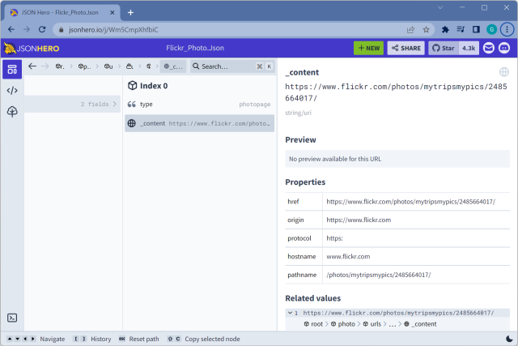
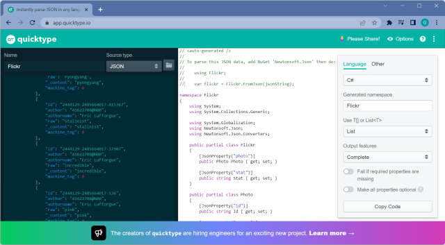
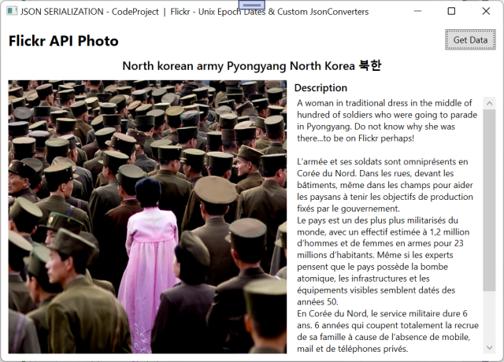
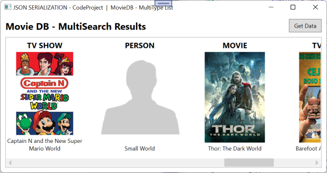
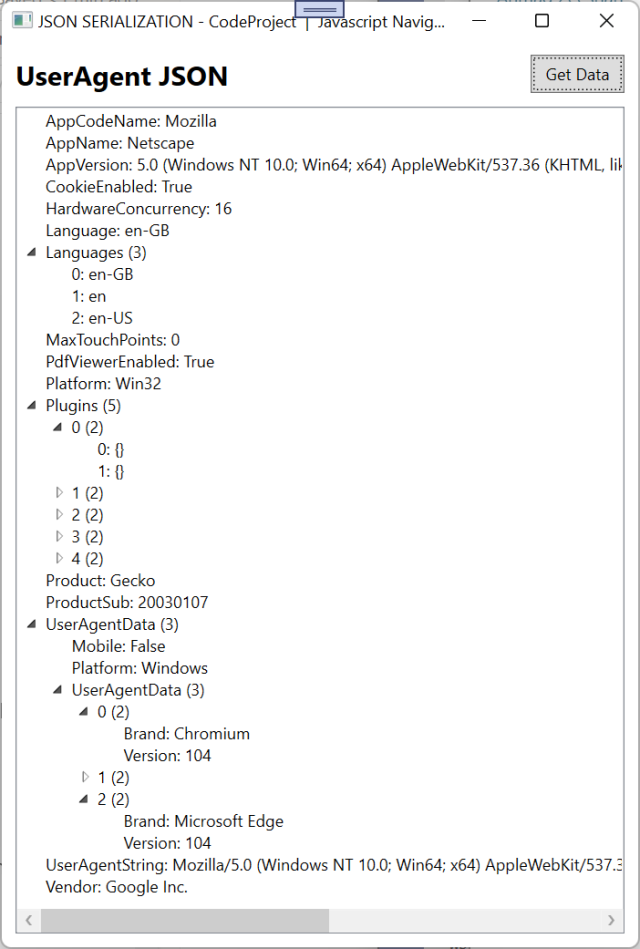
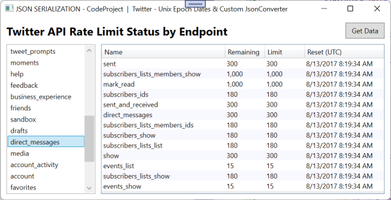

## Working with Json series
* Part 1: [Working with Newtonsoft.Json in C# & VB](https://www.codeproject.com/Articles/1201466/Working-with-Newtonsoft-Json-in-Csharp-VB)
* Part 2: Working with System.Text.Json in C#
* Part 3: Coming soon!

## Introduction
Whilst [JSON](https://www.json.org/json-en.html) is a compact and easy to read cross-language storage and data exchange format, the flexibility that it offers sometimes requires some custom handling to parse the data.

If you are not familiar with JSON, then here is a definition from the official [http://www.json.org](http://www.json.org/):

> **Quote:**
> 
> *JSON (JavaScript Object Notation) is a lightweight data-interchange format. It is easy for humans to read and write. It is easy for machines to parse and generate. It is based on a subset of the JavaScript Programming Language, Standard ECMA-262 3rd Edition - December 1999.*

Microsoft's Explanation of the new [System.Text.Json](https://docs.microsoft.com/en-us/dotnet/standard/serialization/system-text-json-overview?pivots=dotnet-6-0) API:
> **Quote:**
>
> *[System.Text.Json](https://docs.microsoft.com/en-us/dotnet/standard/serialization/system-text-json-overview?pivots=dotnet-6-0) focuses primarily on performance, security, and standards compliance. It has some key differences in default behavior and doesn't aim to have feature parity with [NewtonSoft.Json](https://www.newtonsoft.com/json). For some scenarios, [System.Text.Json](https://docs.microsoft.com/en-us/dotnet/standard/serialization/system-text-json-overview?pivots=dotnet-6-0) currently has no built-in functionality, but there are recommended workarounds. For other scenarios, workarounds are impractical.*

In the next article I will cover one of these "currently has no built-in functionality" features as it is beyond the scope of this article.

## Contents

- Background
- VB Limitation
- Migrating from NewtonSoft.Json to System.Text.Json
- Tools & Libraries
    - Viewers & Validators
    - Code Generators
- Data Conversion
- Standard Data Types
    - Simple Object Types
    - Simple Collection Types
- Non-Standard Types and Data Structure Types
    - UNIX Epoch Timestamps
    - Data Structure Types
    - Flattening Collection Types
    - Multi-Value Type Collections
    - Recursive Deserialization
    - Handling invalid collection property names
    - Data Transformation
- Summary
- Sample Applications
- History

## Background
In the [previous article](https://www.codeproject.com/Articles/1201466/Working-with-Newtonsoft-Json-in-Csharp-VB) we discussed "[Working with Newtonsoft.Json in C# & VB](https://www.codeproject.com/Articles/1201466/Working-with-Newtonsoft-Json-in-Csharp-VB)". The article covered working with simple JSON objects and collections to Custom Converters, Invalid collection property names, and Transforming upon deserialization from Json to classes.

This article will explore the new [System.Text.Json](https://docs.microsoft.com/en-us/dotnet/standard/serialization/system-text-json-overview?pivots=dotnet-6-0) API by porting over the old [NewtonSoft.Json sample projects](https://www.codeproject.com/Articles/1201466/Working-with-Newtonsoft-Json-in-Csharp-VB#sample_applications).

The structure of this article, and the sample projects, will be following the structure of the [previous article](https://www.codeproject.com/Articles/1201466/Working-with-Newtonsoft-Json-in-Csharp-VB). This is done if you are only interested in the new API, but also for those who want to compare [NewtonSoft.Json](https://www.newtonsoft.com/json) with [System.Text.Json](https://docs.microsoft.com/en-us/dotnet/standard/serialization/system-text-json-overview?pivots=dotnet-6-0) and see what is required for the migration process.

## VB Limitation
I wanted to include VB sample code for this article, like I did in the [previous article](https://www.codeproject.com/Articles/1201466/Working-with-Newtonsoft-Json-in-Csharp-VB) for [NewtonSoft.Json](https://www.newtonsoft.com/json). However, as of the writing of this article, version 6.0 DotNet (Core) Ref Strut type used for [Utf8JsonReader](https://docs.microsoft.com/en-us/dotnet/api/system.text.json.utf8jsonreader?view=net-6.0) and [Span<T>](https://docs.microsoft.com/en-us/dotnet/api/system.span-1?view=net-6.0)s are not supported in VB.

So for this article, we will only be working only with C#. You can work around this limitation by using a separate C# Library for your custom converters. We will not be covering this in this article. However, if you wish to do this, you will need to put the converters and the model/poco classes in the same class library projects to avoid circular references.

For now, if you are working with VB, I recommend staying with [NewtonSoft.Json](https://www.newtonsoft.com/json) for your projects.

## Migrating from [NewtonSoft.Json](https://www.newtonsoft.com/json) to [System.Text.Json](https://docs.microsoft.com/en-us/dotnet/standard/serialization/system-text-json-overview?pivots=dotnet-6-0)
When migrating from [NewtonSoft.Json](https://www.newtonsoft.com/json) to [System.Text.Json](https://docs.microsoft.com/en-us/dotnet/standard/serialization/system-text-json-overview?pivots=dotnet-6-0) there are a number of differences. Microsoft has [migration documentation](https://docs.microsoft.com/en-us/dotnet/standard/serialization/system-text-json-migrate-from-newtonsoft-how-to?pivots=dotnet-7-0#required-properties) that covers the differences.

The key difference is:
> **Quote:**
>
> *[System.Text.Json](https://docs.microsoft.com/en-us/dotnet/standard/serialization/system-text-json-overview?pivots=dotnet-6-0) is strict by default and avoids any guessing or interpretation on the caller's behalf, emphasizing deterministic behavior. The library is intentionally designed this way for performance and security. Newtonsoft.Json is flexible by default. This fundamental difference in design is behind many of the following specific differences in default behavior.*

## Tools & Libraries

Like anything, you need the right tools for the job. Here are some of the tools available including those used in this article.

### Viewers & Validators


Sometimes, JSON data is packed and not very readable or we need to validate the raw data:

- [jsonhero.io](https://jsonhero.io/) - visualize the JSON structure and the data within!
- [freeformatter.com](http://www.freeformatter.com/) - exhaustive support for multiple formats
- [codebeautify.org](http://codebeautify.org/) - exhaustive support for multiple formats
- [jsonformatter.org](https://jsonformatter.org/) - beautify, validate, convert JSON & XML
- [jsonformatter.curiousconcept.com](http://jsonformatter.curiousconcept.com/) - format & validate JSON against standards [RFC 4627](http://www.ietf.org/rfc/rfc4627.txt?number=4627), [RFC 7159](https://tools.ietf.org/html/rfc7159), [ECMA-404](http://www.ecma-international.org/publications/files/ECMA-ST/ECMA-404.pdf)
- [jsonlint.com](https://jsonlint.com/) - validate JSON
compare, & validate JSON
- [Fiddler](http://www.telerik.com/fiddler) - web debugging proxy for peeking at HTTP data traffic; see what is actually being sent by the data provider


### Code Generators


We need to create a class structure to convert the raw JSON data to. You could manually create classes from the JSON file which is a very slow and time-consuming task. There are far quicker ways to get this done. Here are a couple:

- [JSON Utils](http://www.jsonutils.com/) - supports both VB & C# with lots of options
- [quicktype.io](https://quicktype.io/) - supports C#, TypeScript, Go Java, Elm, Swift, Simple Types, and Schemas

**NOTE:** Currently, at the time of writing this article, there are no generators that I could find that specifically support [System.Text.Json](https://docs.microsoft.com/en-us/dotnet/standard/serialization/system-text-json-overview?pivots=dotnet-6-0) class/property attributes.

## Data Conversion
Once you have the raw JSON data and created the classes to map the data to, the next step will be to deserialize to classes & serialize from classes. This article will focus on deserialization. 

The following helper class is a clean implementation for handling empty results.
```cs
public static class JsonHelper
{
    /// <summary>
    /// Convert Class to Json object (string)
    /// </summary>
    /// <typeparam name="TClass">Class type to be serialized</typeparam>
    /// <param name="data">Class to serialize</param>
    /// <param name="isEmptyToNull">true = return null if empty; false empty Json object</param>
    /// <param name="options">JsonSerializer options</param>
    /// <returns>Json encoded string</returns>
    public static string FromClass<TClass>(TClass data, bool isEmptyToNull = false, JsonSerializerOptions? options = null)
        where TClass : class
    {
        string response = string.Empty;

        if (!EqualityComparer<TClass>.Default.Equals(data, default))
            response = JsonSerializer.Serialize(data, options: options);

        return isEmptyToNull ? response == "{}" ? "null" : response : response;
    }

    /// <summary>
    /// Convert a Json object (string) to a class
    /// </summary>
    /// <typeparam name="TClass">Class type to be deserialized into</typeparam>
    /// <param name="data">Json string to be deserialized</param>
    /// <param name="options">JsonSerializer options</param>
    /// <returns>Deserialized class of TClass</returns>
    public static TClass? ToClass<TClass>(string data, JsonSerializerOptions? options = null)
        where TClass : class
    {
        TClass? response = default(TClass);

        return string.IsNullOrEmpty(data)
            ? response
            : JsonSerializer.Deserialize<TClass>(data, options ?? null);
    }
}
```
## Standard Data Types
Let us start with something simple. The following two examples work with the .Net primitive data and collection types.

### Simple Object Types
Here is a v2 Category Json object from the [Etsy API](https://www.etsy.com/developers/). All JSON fields map to .NET primitive data types.
```json
{
        "category_id": 68890752,
        "name": "gloves",
        "meta_title": "Handmade Gloves on Etsy - Gloves, mittens, arm warmers",
        "meta_keywords": "handmade gloves, gloves, handmade arm warmers, 
         handmade fingerless gloves, handmade mittens, hand knit mittens, 
         hand knit gloves, handmade accessories",
        "meta_description": "Shop for unique, handmade gloves on Etsy, 
         a global handmade marketplace. Browse gloves, arm warmers, 
         fingerless gloves & more from independent artisans.",
        "page_description": "Shop for unique, handmade gloves from our artisan community",
        "page_title": "Handmade gloves",
        "category_name": "accessories\/gloves",
        "short_name": "Gloves",
        "long_name": "Accessories > Gloves",
        "num_children": 3
}
```
[System.Text.Json](https://docs.microsoft.com/en-us/dotnet/standard/serialization/system-text-json-overview?pivots=dotnet-6-0) supports enabling case-insensitive property name matching via the `JsonSerializerOptions`:
```cs
var options = new JsonSerializerOptions
{
    PropertyNameCaseInsensitive = true
};
```
You pass the options to the serializer when deserializing:
```cs
public Category Result { get; set; }

private const string fileName = "Etsy_Category.Json";
private readonly string filePath = Environment.CurrentDirectory;

private void GetData()
{
    // Retrieve JSON data from file
    var rawJson = File.ReadAllText(Path.Combine(filePath, fileName));

    // Convert to C# Class typed object
    Result = JsonHelper.ToClass<Category>(rawJson, options);
}
```
Now you can use POCO (Plain Old Class Objects):
```cs
public class Category
{
    public int? CategoryId { get; set; }
    public string? Name { get; set; }
    public string? MetaTitle { get; set; }
    public string? MetaKeywords { get; set; }
    public string? MetaDescription { get; set; }
    public string? PageDescription { get; set; }
    public string? PageTitle { get; set; }
    public string? CategoryName { get; set; }
    public string? ShortName { get; set; }
    public string? LongName { get; set; }
    public int? NumChildren { get; set; }
}
```
If you want to use manual mapping via Attributes, use the `JsonPropertyName` attribute, formally `JsonProperty` for NewtonSoft.
```cs
public class Category
{
    [JsonPropertyName("category_id")]
    public int? CategoryId { get; set; }

    [JsonPropertyName("name")]
    public string? Name { get; set; }

    [JsonPropertyName("meta_title")]
    public string? MetaTitle { get; set; }

    [JsonPropertyName("meta_keywords")]
    public string? MetaKeywords { get; set; }

    [JsonPropertyName("meta_description")]
    public string? MetaDescription { get; set; }

    [JsonPropertyName("page_description")]
    public string? PageDescription { get; set; }

    [JsonPropertyName("page_title")]
    public string? PageTitle { get; set; }

    [JsonPropertyName("category_name")]
    public string? CategoryName { get; set; }

    [JsonPropertyName("short_name")]
    public string? ShortName { get; set; }

    [JsonPropertyName("long_name")]
    public string? LongName { get; set; }

    [JsonPropertyName("num_children")]
    public int? NumChildren { get; set; }
}
```
Now we can deserialize the JSON data into .NET class[es]:
```cs
public Category Result { get; set; }

private const string fileName = "Etsy_Category.Json";
private readonly string filePath = Environment.CurrentDirectory;

private void GetData()
{
    // Retrieve JSON data from file
    var rawJson = File.ReadAllText(Path.Combine(filePath, fileName));

    // Convert to C# Class typed object
    Result = JsonHelper.ToClass<Category>(rawJson);
}
```
And now can work with the data. Here is a screenshot of the attached sample app (`WinFormSimpleObject`):


### Simple Collection Types

The [Etsy API](https://www.etsy.com/developers/), like many other APIs, work with not only single objects but also collections of objects wrapped in a JSON response.
```json
{
    "count": 27,
    "results": [{
        "category_id": 68890752,
        "name": "gloves",
        "meta_title": "Handmade Gloves on Etsy - Gloves, mittens, arm warmers",
        "meta_keywords": "handmade gloves, gloves, handmade arm warmers, 
         handmade fingerless gloves, handmade mittens, hand knit mittens, 
         hand knit gloves, handmade accessories",
        "meta_description": "Shop for unique, handmade gloves on Etsy, 
         a global handmade marketplace. Browse gloves, arm warmers, 
         fingerless gloves & more from independent artisans.",
        "page_description": "Shop for unique, handmade gloves from our artisan community",
        "page_title": "Handmade gloves",
        "category_name": "accessories\/gloves",
        "short_name": "Gloves",
        "long_name": "Accessories > Gloves",
        "num_children": 3
    },
    {
        "category_id": 68890784,
        "name": "mittens",
        "meta_title": "Handmade Mittens on Etsy - Mittens, gloves, arm warmers",
        "meta_keywords": "handmade mittens, handcrafted mittens, mittens, 
         accessories, gloves, arm warmers, fingerless gloves, mittens, 
         etsy, buy handmade, shopping",
        "meta_description": "Shop for unique, handmade mittens on Etsy, 
         a global handmade marketplace. Browse mittens, arm warmers, 
         fingerless gloves & more from independent artisans.",
        "page_description": "Shop for unique, handmade mittens from our artisan community",
        "page_title": "Handmade mittens",
        "category_name": "accessories\/mittens",
        "short_name": "Mittens",
        "long_name": "Accessories > Mittens",
        "num_children": 4
    }],
    "params": {
        "tag": "accessories"
    },
    "type": "Category",
    "pagination": {
        
    }
}
```
Here is our response wrapper:
```cs
public class Pagination
{
    [JsonPropertyName("effective_limit")]
    public int? EffectiveLimit { get; set; }

    [JsonPropertyName("effective_offset")]
    public int? EffectiveOffset { get; set; }

    [JsonPropertyName("effective_page")]
    public int? EffectivePage { get; set; }

    [JsonPropertyName("next_offset")]
    public int? NextOffset { get; set; }

    [JsonPropertyName("next_page")]
    public int? NextPage { get; set; }
}

public class Params
{
    [JsonPropertyName("tag")]
    public string? Tag { get; set; }
}

public class Response<TModel> where TModel : class
{
    [JsonPropertyName("count")]
    public int? Count { get; set; }

    [JsonPropertyName("results")]
    public IList<TModel>? Results { get; set; }

    [JsonPropertyName("params")]
    public Params? Params { get; set; }

    [JsonPropertyName("type")]
    public string? Type { get; set; }

    [JsonPropertyName("pagination")]
    public Pagination? Pagination { get; set; }
}
```
Now we can deserialize the JSON data into .Net class[es]:
```cs
public BindingList<Category> Categories { get; } = new();

public void HandleClicked() => GetData();

private void GetData()
{
    // Retrieve JSON data from file
    string rawJson = File.ReadAllText(Path.Combine(filePath, fileName));

    // Convert to C# Class typed object
    Response<Category>? response = JsonHelper.ToClass<Response<Category>>(rawJson);

    // Get collection of objects
    if (response is { Results.Count: > 0 })
    {
        IList<Category>? data = response.Results;

        Categories.Clear();

        for (int i = 0; i < data.Count; i++)
            Categories.Add(data[i]);
    }
}
```
Now we can work with the data. Here is a screenshot of the attached sample app (`WinFormSimpleCollection`):


## Non-Standard Types and Data Structure Types

Not all languages across all platforms have compatible data types. Also, providers that support multiple data formats don't always have clean translations across data formats. The next section will cover these issues and address them with simple solutions.

Unlike Netwonsoft.Json, [System.Text.Json](https://docs.microsoft.com/en-us/dotnet/standard/serialization/system-text-json-overview?pivots=dotnet-6-0) was completely rewritten and uses strongly typed base `JsonConverter`. This breaks compatibility with [NewtonSoft.Json converters](https://www.newtonsoft.com/json/help/html/CustomJsonConverter.htm). I have ported the converters from the previous article so that comparisons can be made. I will add comments based on the experience.

### UNIX Epoch Timestamps
What is a UNIX epoch timestamp? According to [Wikipedia.org](https://en.wikipedia.org/wiki/Unix_time):

> Quote:
> 
> A system for describing instants in time, defined as the number of seconds that have elapsed since 00:00:00 Coordinated Universal Time (UTC), Thursday, 1 January 1970,[1][note 1] minus the number of leap seconds that have taken place since then.
Here is an example from [Twitter](https://dev.twitter.com/index):

```json
"reset": 1502612374
```
And here is an example from [Flickr](https://www.flickr.com/services/api/):
```json
"lastupdate": "1502528455"
```
We could have an integer property field and convert the integer epoch timestamp into a `DateTime` type post deserialization. The alternative and a better solution is to use a custom `JsonConverter` attribute:
```cs
internal static class Unix
{
    internal static readonly DateTime Epoch = new DateTime
    (year: 1970, month: 1, day: 1, hour: 0, minute: 0, second: 0, millisecond: 0, 
     kind: DateTimeKind.Utc);
}

public static class DoubleExtensions
{
    public static DateTime FromUnixDate(this double? unixDate)
    {
        return Unix.Epoch.AddSeconds(unixDate ?? 0.0);
    }

    public static DateTime FromUnixDate(this double unixDate)
    {
        return Unix.Epoch.AddSeconds(unixDate);
    }
}

public sealed class JsonUnixDateConverter : JsonConverter<DateTime?>
{
    public override DateTime? Read(ref Utf8JsonReader reader, Type typeToConvert, JsonSerializerOptions options)
        => reader.TokenType switch
        {
            JsonTokenType.Number => reader.GetDouble().FromUnixDate(),
            JsonTokenType.String => double.TryParse(reader.GetString(), out var value)
                ? value.FromUnixDate()
                : typeToConvert == typeof(DateTime)
                    ? default
                    : null,
            _ => throw new JsonException()
        };

    public override void Write(Utf8JsonWriter writer, DateTime? value, JsonSerializerOptions options)
        => throw new NotImplementedException();
}
```
#### How it works
As the Converter is strongly typed. If you try to use the converter on the wrong data type, a `System.InvalidOperationException` will be thrown at runtime. `JsonUnixDateConverter.Read` method executes, parses the value, converts from UNIX epoch to .Net DateTime type, and returns the value to be assigned to the class property.

#### How to Use
Simply apply the JsonUnixDateConverter to the property:
```cs
[JsonPropertyName("dateuploaded"), JsonConverter(typeof(JsonUnixDateConverter))]
public DateTime? DateUploaded { get; set; }
```
### Data Structure Types
Some data providers support multiple data formats: XML, JSON, etc... and differences in the format can create some interesting data structure types. Data structure types are where a single variable type is described as an object rather than a simple value.



Flickr has many examples of this where XML does not directly translate - XML has both attributes and elements describing data where JSON only has fields. An example of this is the Photo object and the comment count field:
```json
{
    "photo": {
        "comments": {
            "_content": "483"
        }
    }
}
```
If we do a one-to-one translation, the classes required would be:
```cs
public class Comments
{
    [JsonPropertyName("_content")]
    public int Count { get; set; }
}

public class Photo
{
    [JsonPropertyName("comments")]
    public Comments Comments { get; set; }
}
```
Then to use the above class structure:
```cs
int GetCommentCount(Photo photo)
{
    return photo.Comments.Count;
}
```
It would be much better if we could simplify the Comment count into a single integer rather than a class object:
```cs
int GetCommentCount(Photo photo)
{
    return photo.CommentCount;
}
```
[Flickr](https://www.flickr.com/services/api/) has a number of other value data types that work the same. For example, the photo title field:

```json
"title": {
    "_content": "North korean army Pyongyang North Korea \ubd81\ud55c"
}
```
The solution is a generic JsonConverter:
```cs
public class JsonFlickrContentConverter<TObject> : JsonConverter<TObject>
{
    public override TObject? Read(ref Utf8JsonReader reader, Type typeToConvert, JsonSerializerOptions options)
    {
        // position reader

        reader.Read(); // read Property TObject_property
        reader.Read(); // read Property "_content"

        // Get the value of "_content" and convert to the correct type
        TObject? result = (TObject?)Convert.ChangeType(reader.GetString(), GetUnderlyingType());
        
        reader.Read(); // read EndObject for TObject

        return result;
    }

    // converts Generic nullable type to underlying type
    // eg: int? to int
    private Type GetUnderlyingType()
    {
        Type type = typeof(TObject);
        return Nullable.GetUnderlyingType(type) ?? type;
    }

    public override void Write(Utf8JsonWriter writer, TObject? value, JsonSerializerOptions options)
        => throw new NotImplementedException();
}
```
And to use:
```cs
public class Photo
{
    [JsonPropertyName("comments"), JsonConverter(typeof(JsonFlickrContentConverter<int?>))]
    public int? Comments { get; set; }
    
    [JsonPropertyName("title"), JsonConverter(typeof(JsonFlickrContentConverter<string?>))]
    public string? Title { get; set; }
}
```
**NOTE:** Here we define the return type for the `JsonFlickrContentConverter`. For comments, we use `int?` and for Title we use `string?`. I'm using nullable types here however you can use any type so long as the converter type matches the property type.

### Flattening Collection Types
Like data structure types, a collection of objects also sometimes do not translate well from XML to JSON. [Flickr](https://www.flickr.com/services/api/) has many examples of this. The [Photo.Notes](https://www.flickr.com/services/api/flickr.photos.getInfo.html) collection is a typical example:

```json
"notes": {
    "note": [{
        "id": "72157613689748940",
        "author": "22994517@N02",
        "authorname": "morningbroken",
        "authorrealname": "",
        "authorispro": 0,
        "x": "227",
        "y": "172",
        "w": "66",
        "h": "31",
        "_content": "Maybe ~ I think  ...She is very happy ."
    },
    {
        "id": "72157622673125344",
        "author": "40684115@N06",
        "authorname": "Suvcon",
        "authorrealname": "",
        "authorispro": 0,
        "x": "303",
        "y": "114",
        "w": "75",
        "h": "60",
        "_content": "this guy is different."
    }]
},
```
Class structure would be:
```cs
public class Photo
{
    [JsonPropertyName("notes")]
    public Notes Notes { get; set; }
}

public class Notes
{
    [JsonPropertyName("note")]
    public List<Note> Note { get; set; }
}
```
As you can see, we end up with an extra unwanted `Notes` class to hold the list of `Note`.

We can simplify the classes required using a custom `JsonConverter` to collapse the data structure:
```cs
public class JsonFlickrCollectionConverter<TModel> : JsonConverter<List<TModel>?> where TModel : class
{
    public override List<TModel> Read(ref Utf8JsonReader reader, Type typeToConvert, JsonSerializerOptions options)
    {
        if (reader.TokenType != JsonTokenType.StartObject)
            throw new JsonException();

        // position reader

        reader.Read(); // move to property name
        reader.Read(); // move to start of the array

        if (reader.TokenType != JsonTokenType.StartArray)
            throw new JsonException();

        List<TModel> items = new();

        // Walk through all of the items in the array
        while (reader.TokenType != JsonTokenType.EndArray)
            items.AddRange(JsonSerializer.Deserialize<List<TModel>>(ref reader, options)!);

        reader.Read(); // move to EndObject

        return items;
    }

    public override void Write(Utf8JsonWriter writer, List<TModel>? value, JsonSerializerOptions options)
        => throw new NotImplementedException();
}
```
And to use:

```
[JsonPropertyName("notes"), JsonConverter(typeof(JsonFlickrCollectionConverter<Note>))]
public List<Note>? Notes { get; set; }
```

### Multi-Value Type Collections

Also known as **Polymorphic Deserialization**, is where a collection of objects returned are of similar or different complex object types. [themoviedb.org](https://www.themoviedb.org/documentation/api) [Multi search](https://developers.themoviedb.org/3/search/multi-search) returns `TV`, `Move`, and `Person` types in the same collection. [Google Drive](https://developers.google.com/drive/v3/web/about-sdk) is another example that returns a collection with [File and Folder](https://developers.google.com/drive/v3/web/about-files) complex object types.

#### MovieDB.Org

Here is a screenshot of the included [MovieDB](https://www.themoviedb.org/documentation/api) demo app that shows an example of this (`WpfMultiSearch`):



The JSON data for the above screenshot looks like this (WpfMultiSearch):
```json
{
    "page": 1,
    "total_results": 3433,
    "total_pages": 172,
  "results": [
    {
      "original_name": "Captain N and the New Super Mario World",
      "id": 26732,
      "media_type": "tv",
      "name": "Captain N and the New Super Mario World",
      "vote_count": 2,
      "vote_average": 3.5,
      "poster_path": "/i4Q8a0Ax5I0h6b1rHOcQEZNvJzG.jpg",
      "first_air_date": "1991-09-14",
      "popularity": 1.479857,
      "genre_ids": [
        16,
        35
      ],
      "original_language": "en",
      "backdrop_path": "/iYT5w3Osv3Bg1NUZdN9UYmVatPs.jpg",
      "overview": "Super Mario World is an American animated television series 
       loosely based on the Super NES video game of the same name. 
       It is the third and last Saturday morning cartoon based on the Super Mario Bros. 
       NES and Super NES series of video games. The show only aired 13 episodes 
       due to Captain N: The Game Master's cancellation on NBC. 
       Just like The Adventures of Super Mario Bros. 3, the series is produced by 
       DIC Entertainment and Reteitalia S.P.A in association with Nintendo, 
       who provided the characters and power-ups from the game.",
      "origin_country": [
        "US"
      ]
    },
    {
      "popularity": 1.52,
      "media_type": "person",
      "id": 1435599,
      "profile_path": null,
      "name": "Small World",
      "known_for": [
        {
          "vote_average": 8,
          "vote_count": 1,
          "id": 329083,
          "video": false,
          "media_type": "movie",
          "title": "One For The Road: Ronnie Lane Memorial Concert",
          "popularity": 1.062345,
          "poster_path": "/i8Ystwg81C3g9a5z3ppt3yO1vkS.jpg",
          "original_language": "en",
          "original_title": "One For The Road: Ronnie Lane Memorial Concert",
          "genre_ids": [
            10402
          ],
          "backdrop_path": "/oG9uoxtSuokJBgGO4XdC5m4uRGU.jpg",
          "adult": false,
          "overview": "At The Royal Albert Hall, London on 8th April 2004 
           after some 15 months of planning with Paul Weller, Ronnie Wood, 
           Pete Townshend, Steve Ellis, Midge Ure, Ocean Colour Scene amongst them 
           artists assembled to perform to a sell-out venue and to pay tribute to a man 
           who co-wrote many Mod anthems such as \"\"Itchycoo Park, All Or Nothing, 
           Here Comes The Nice, My Mind's Eye\"\" to name just a few. 
           Ronnie Lane was the creative heart of two of Rock n Rolls quintessentially 
           English groups, firstly during the 60's with The Small Faces then 
           during the 70;s with The Faces. After the split of the Faces he then 
           formed Slim Chance and toured the UK in a giant circus tent as well as 
           working in the studio with Eric Clapton, Pete Townshend and Ronnie Wood. 
           5,500 fans looked on in awe at The R.A.H as the superb evening's entertainment 
           ended with \"\"All Or Nothing\"\" featuring a surprise appearance by 
           Chris Farlowe on lead vocals.",
          "release_date": "2004-09-24"
        }
      ],
      "adult": false
    },
    {
      "vote_average": 6.8,
      "vote_count": 4429,
      "id": 76338,
      "video": false,
      "media_type": "movie",
      "title": "Thor: The Dark World",
      "popularity": 10.10431,
      "poster_path": "/bnX5PqAdQZRXSw3aX3DutDcdso5.jpg",
      "original_language": "en",
      "original_title": "Thor: The Dark World",
      "genre_ids": [
        28,
        12,
        14
      ],
      "backdrop_path": "/3FweBee0xZoY77uO1bhUOlQorNH.jpg",
      "adult": false,
      "overview": "Thor fights to restore order across the cosmos… 
       but an ancient race led by the vengeful Malekith returns to plunge 
       the universe back into darkness. Faced with an enemy that even Odin and Asgard 
       cannot withstand, Thor must embark on his most perilous and personal journey yet, 
       one that will reunite him with Jane Foster and force him to sacrifice everything 
       to save us all.",
      "release_date": "2013-10-29"
    }
  ]
}
```
The key to identifying the different complex data types is with a key field. In the above [MovieDB](https://www.themoviedb.org/documentation/api) JSON data example, the key field is `media_type`.

When we define the classes for the three data types `TV,` `Movie`, and `Person`, we will use a simple Interface against each class type for the collection:
```cs
public interface IDataType
{
}
```
A custom JsonConverter `JsonDataTypeConverter` is used on the collection. It identifies the object type, using the `"media_type"` property, and generates the appropriate class and populates the fields:
```cs
public class JsonDataTypeConverter : JsonConverter<List<IDataType>?>
{
    public override List<IDataType>? Read(ref Utf8JsonReader reader, Type typeToConvert, JsonSerializerOptions options)
    {
        if (reader.TokenType != JsonTokenType.StartArray)
            return default;

        // polymorphic deserialization
        List<IDataType>? items = default;

        // walk through all of the items in the collection
        foreach (JsonObject jsonObject in JsonSerializer.Deserialize<List<JsonObject>>(ref reader, options)!)
        {
            // Deserialize based on media_type field
            IDataType? item = jsonObject["media_type"]?.GetValue<string>() switch
            {
                "tv" => jsonObject.Deserialize<TV>(options)!,
                "movie" => jsonObject.Deserialize<Movie>(options)!,
                "person" => jsonObject.Deserialize<Person>(options)!,
                _ => null
            };

            if (item is null) continue;

            items ??= new();
            items.Add(item);
        }

        return items;
    }

    public override void Write(Utf8JsonWriter writer, List<IDataType>? value, JsonSerializerOptions options)
        => throw new NotImplementedException();
}
```
And to use:
```cs
public class Response
{
    [JsonPropertyName("results"), JsonConverter(typeof(JsonDataTypeConverter))]
    public List<IDataType>? Results { get; set; }
}
```
Below is a screenshot of the collection when viewing the IntelliSense debug window showing the collection with multiple object types:


#### Google Drive

Another example of this is [Google Drive API](https://developers.google.com/drive/v3/web/about-sdk). The [File](https://developers.google.com/drive/v3/reference/files) type, for example, has two identifiers: one to differentiate between Files and Folder, and another for the type of [File](https://developers.google.com/drive/v3/reference/files) - Jpg, Png, Text file, Document, MP4, etc. This can be seen in the JSON data.
```
{
 "kind": "drive#fileList",
 "incompleteSearch": false,
 "files": [
  {
   "kind": "drive#file",
   "mimeType": "video/mp4"
  },
  {
   "kind": "drive#file",
   "mimeType": "application/vnd.google-apps.folder"
  },
  {
   "kind": "drive#file",
   "mimeType": "application/vnd.openxmlformats-officedocument.presentationml.presentation"
  },
  {
   "kind": "drive#file",
   "mimeType": "application/vnd.openxmlformats-officedocument.wordprocessingml.document"
  },
  {
   "kind": "drive#file",
   "mimeType": "text/plain"
  },
  {
   "kind": "drive#file",
   "mimeType": "image/png"
  }
 ]
}
```
The different [File](https://developers.google.com/drive/v3/reference/files) types can be seen reflected in the following sample application screenshot (`WpfFileExplorer`):


The sample app above works with a Hierarchical data structure and loads each branch's data on-demand as it is opened.

All the different types of files have the same data. So we can declare a base type and inherit it for all the different types of files.
```cs
[DebuggerDisplay("[File] {Name} ({Kind} | {MimeType})")]
public class File : IResourceKind
{
    [JsonPropertyName("kind")]
    public string? Kind { get; set; }

    [JsonPropertyName("mimeType")]
    public string? MimeType { get; set; }
}

[DebuggerDisplay("[FOLDER] {Name}")]
public class Folder : File
{
}

[DebuggerDisplay("[TXT DOCUMENT] {Name}")]
public class TxtDocument : File
{
}

[DebuggerDisplay("[EXCEL DOCUMENT] {Name}")]
public class ExcelDocument : File
{

}

[DebuggerDisplay("[PNG IMAGE] {Name}")]
public class PngImage : File
{
}

[DebuggerDisplay("[MP4 VIDEO] {Name}")]
public class Mp4Video : File
{
}

[DebuggerDisplay("[ZIPPED] {Name}")]
public class Zipped : File
{
}
```
**Side Note:** When when working with Implicit templates in XAML, you can define a default template, in this case for the base File Type, and if an implicit template is not found for the data type (class), the base template is applied for the inherited base class type.
```xml
<DataTemplate DataType="{x:Type m:File}">
    <!-- Template here -->
</DataTemplate>
```
As there is a common base type for a large number of [File](https://developers.google.com/drive/v3/reference/files) types, a compact handler inside a customer [JsonConverter](http://www.newtonsoft.com/json/help/html/T_Newtonsoft_Json_JsonConverterAttribute.htm), `JsonDataTypeConverter` for [Google Drive](https://developers.google.com/drive/v3/web/about-sdk), can be used. Here we will have a lookup Dictionary Table for the `"mime_type"` JSON field and method reference with conversion type.
```cs
public sealed class JsonDataTypeConverter : JsonConverter<List<File>?>
{
    public override List<File>? Read(ref Utf8JsonReader reader, Type typeToConvert, JsonSerializerOptions options)
    {
        if (reader.TokenType != JsonTokenType.StartArray)
            return default;

        List<File> items = new();

        // walk through all of the items in the collection
        foreach (JsonObject jsonObject in JsonSerializer.Deserialize<List<JsonObject>>(ref reader, options)!)
        {
            // Deserialize based on kind field
            string? kind = jsonObject["kind"]?.GetValue<string>();

            if (string.IsNullOrEmpty(kind))
                continue;

            if (kind.Equals("drive#file"))
                ProcessFileType(jsonObject, items);
        }

        return items;
    }

    // polymorphic deserialization
    private void ProcessFileType(JsonObject jsonObject, List<File> items)
    {
        // Deserialize based on mimeType field
        string? mimeType = jsonObject["mimeType"]?.GetValue<string>();

        if (string.IsNullOrEmpty(mimeType))
            return;

        items.Add(MimeToFileConverter.Types[mimeType](jsonObject));
    }

    public override void Write(Utf8JsonWriter writer, List<File>? value, JsonSerializerOptions options)
        => throw new NotImplementedException();
}
```
The supported mapping class:
```cs
public static class MimeToFileConverter
{
    // only some types are lists for briefity
    public static readonly Dictionary<string, Func<JsonObject, File>> Types = new()
    {
        { "application/vnd.google-apps.folder", Convert<Folder>()! },
        { "image/jpeg", Convert<JpgImage>()! },
        { "image/png", Convert<PngImage>()! },
        { "application/zip", Convert<Zipped>()! },
        { "application/x-zip-compressed", Convert<Zipped>()! },
        { "video/mp4", Convert<Mp4Video>()! },
        { "text/plain", Convert<TxtDocument>()! },
        { "application/vnd.openxmlformats-officedocument.presentationml.presentation", Convert<PptDocument>()! },
        { "application/vnd.openxmlformats-officedocument.wordprocessingml.document", Convert<WordDocument>()! }
    };
    
    // Convert Json Object data into a specified class type
    private static Func<JsonObject, File?> Convert<TModel>() where TModel : File
        => jsonObject => JsonHelper.ToClass<TModel>(jsonObject.ToString(), JsonSerializerConfiguration.Options);
}
```
The IntelliSense debug window for the [File](https://developers.google.com/drive/v3/reference/files) collection property correctly reflects the recursive deserialization of the different [File](https://developers.google.com/drive/v3/reference/files) types:


### Recursive Deserialization

JSON object structures can be many node levels deep. Each node could have properties with their own custom [JsonConverter](http://www.newtonsoft.com/json/help/html/T_Newtonsoft_Json_JsonConverterAttribute.htm)s. An example of this is the [MovieDB](https://www.themoviedb.org/documentation/api) above in the previous section **Multi-Value Type Collections**. Here is an extract for the `Person` JSON node structure with the node collection `known_for` :
```
{
    "page": 1,
    "total_results": 3433,
    "total_pages": 172,
  "results": [
    {
      "media_type": "tv",
    },
    {
      "media_type": "person",
      "known_for": [
        {
          "media_type": "movie",
        }
      ]
    },
    {
      "media_type": "movie",
    }
  ]
}
```

The `JsonDataTypeConverter` class above already supports recursive deserialization and will automagically deserialize the structure.

The `Person` class, we apply the [JsonConverter](http://www.newtonsoft.com/json/help/html/T_Newtonsoft_Json_JsonConverterAttribute.htm) attribute `JsonDataTypeConverter`:
```
public class Person : RecordBase
{
    [JsonPropertyName("known_for"), JsonConverter(typeof(JsonDataTypeConverter))]
    public List<IDataType>? KnownFor { get; set; }
}
```
Here, we can see from the IntelliSense debug window for the `Person.KnownFor` collection property and correctly reflects the recursive deserialization of the `Movie` class type:


### Handling invalid collection property names in a Javascript JSON

Javascript is not as strict as the C# language and allows property names that are invalid for C#. For example (an extract from the output of Json generated by Javascript Navigator object):
```json
{
    ...
    "plugins": {
        "0": {
            "0": {},
            "1": {}
        },
        "1": {
            "0": {},
            "1": {}
        },
        "2": {
            "0": {},
            "1": {}
        },
        "3": {
            "0": {},
            "1": {}
        },
        "4": {
            "0": {},
            "1": {}
        }
    },
    ...
}
```
As you can see, we have invalid property names like `"0"`, `"1"`, `"2"`, etc. In C#, property names must start with an alphanumeric character. As this is a collection, we can not just use a JsonProperty attribute on a number of properties as we do not know how many elements/properties to expect.

If you tried to deserialise the above JSON "plugins" object without a custom `JsonConverter`, you would see something like the following error:


A standard JSON collection is enclosed within square brakets and looks like this:
```json
{
    ....
    "languages": [
        "en-GB",
        "en",
        "en-US"
    ],
    ....
}
```
There are a number of ways to handle the "plugins" collection in a custom JsonConverter. You could choose to use `Dictionary<string, <Dictionary<string, Object>>` or `List<Dictionary<string, Object>>` or `List<List<Object>>`. For this article, I have chosen to embrace the non-standard property naming by using classes.
```cs
public class UserAgentModel
{
    [JsonPropertyName("plugins"), JsonConverter(typeof(UserAgentPluginsConverter))]
    public List<PluginModel>? Plugins { get; set; }
}

public class PluginModel
{
    public string? Id { get; set; }
    public List<PluginObjectModel>? Values { get; set; }
}

public class PluginObjectModel
{
    public string? Id { get; set; }
    public object? Value { get; set; }
}
```
A custom `JsonConverter` `UserAgentPluginsConverter` is used to map the JSON to the class structure.
```cs
public class UserAgentPluginsConverter : JsonConverter<List<PluginModel>?>
{
    public override List<PluginModel>? Read(ref Utf8JsonReader reader, Type typeToConvert, JsonSerializerOptions options)
    {
        if (reader.TokenType != JsonTokenType.StartObject)
            return default;

        List<PluginModel>? plugins = new();

        foreach (KeyValuePair<string, JsonNode?> jsonObject in JsonSerializer.Deserialize<JsonObject>(ref reader, options)!)
            plugins.Add(new()
            {
                Id = jsonObject.Key,
                Values =  GetValues(jsonObject.Value)
            });

        return plugins;
    }

    private List<PluginObjectModel> GetValues(JsonNode? jsonNode)
    {
        List<PluginObjectModel> objects = new();

        foreach (KeyValuePair<string, JsonNode?> node in jsonNode.Deserialize<JsonObject>()!)
        {
            objects.Add(new()
            {
                Id = node.Key,
                Value = node.Value.Deserialize<object>()
            });
        }

        return objects;
    }

    public override void Write(Utf8JsonWriter writer, List<PluginModel>? value, JsonSerializerOptions options)
        => throw new NotImplementedException();
}
```
Now our model will look as we expect.


And finally our sample application can display the data (`WpfUserAgent`):



### Data Transformation
Normally, to transform data, it is a two-step process. First, we convert the JSON data to .NET classes (34 classes in total in this case), then transform the data.


The last example that I have demonstrated how to transform the JSON data to a custom class collection in a single step. By doing this, we have reduced the number of classes required, in this case, from 34 to 4!


Here is what the end result will look like (`WpfApplicationRateLimitStatus`):



As there are too many data classes to post here, I will only discuss the JsonConverter used. You can view and run the sample project, `WpfApplicationRateLimitStatus` which is included in the download. I have included both the standard and custom mapping classes.

The `JsonApiRateLimitsConverter` compresses the multiple classes into a simpler collection of data that is compatible with the application's requirements.

```cs
public sealed class JsonApiRateLimitsConverter : JsonConverter<ObservableCollection<RateCategoryModel>?>
{
    public override ObservableCollection<RateCategoryModel>? Read(ref Utf8JsonReader reader, Type typeToConvert, JsonSerializerOptions options)
    {
        if (reader.TokenType != JsonTokenType.StartObject)
            return default;

        ObservableCollection<RateCategoryModel> items = new();

        foreach (KeyValuePair<string, JsonNode?> jsonObject in JsonSerializer
                     .Deserialize<JsonObject>(ref reader, options)!)

            if (ProcessChild(jsonObject, options) is { } rate)
                items.Add(rate);

        return items.Count > 0
            ? items
            : default;
    }

    private RateCategoryModel ProcessChild(KeyValuePair<string, JsonNode?> jsonObject, JsonSerializerOptions options)
    {
        RateCategoryModel rate = new() { Name = jsonObject.Key };

        foreach (KeyValuePair<string, JsonNode?> child in jsonObject.Value.Deserialize<JsonObject>(options)!)
        {
            ApiRateLimitModel? limit = child.Value.Deserialize<ApiRateLimitModel>(options);

            if (limit is null)
                continue;

            rate.Limits.Add(new()
            {
                Name = GetPropertyName(child.Key),
                Limit = limit
            });
        }

        return rate;
    }

    private static string GetPropertyName(string value)
    {
        string name = "__no_name__";

        if (!string.IsNullOrEmpty(value))
        {
            string[] parts = value.Split(new[] { '/' }, StringSplitOptions.RemoveEmptyEntries);
            name = string.Join("_", parts.Skip(1)).Replace(":", "");

            if (string.IsNullOrEmpty(name))
                name = parts[0];
        }

        return name;
    }
    
    public override void Write(Utf8JsonWriter writer, ObservableCollection<RateCategoryModel>? value, JsonSerializerOptions options)
        => throw new NotImplementedException();
}
```
And to use:
```cs
public class APIRateStatusModel
{
    [JsonPropertyName("resources"), JsonConverter(typeof(JsonApiRateLimitsConverter))]
    public ObservableCollection<RateCategoryModel>? Resources { get; set; }
}
```
```cs
private void GetData(string buttonName)
{
    // Retrieve JSON data from file
    string rawJson = File.ReadAllText(Path.Combine(filePath, fileName));

    // Convert to C# Class List of typed objects
    Result = JsonHelper.ToClass<APIRateStatusModel>(rawJson);
}
```
## Summary
The article not only show how to work with the [System.Text.Json](https://docs.microsoft.com/en-us/dotnet/standard/serialization/system-text-json-overview?pivots=dotnet-6-0) API, but also a migration of the NewtonSoft.Json code from the linked previous article.

## Sample Applications
There are seven (7) sample DotNet (Core) applications included in the download:

1. `WinFormSimpleObject` - Etsy Category
    * WinForm, code-behind
2. `WinFormSimpleCollection` - Etsy Categories
    * WinForm, Datbinding, MVVM (simple)
3. `WpfPhoto` - Flickr Photo Viewer
    * WPF, MVVM
    * JsonFlickrCollectionConverter, JsonFlickrContentConverter, JsonFlickrUnixDateContentConverter, JsonFlickrUriContentConverter, StringEnumConverter
4. `WpfMultiSearch` - MovieDB MultiSearch result
    * WPF, MVVM, Implicit Templates
JsonDataTypeConverter, JsonPartialUrlConverter
6. `WpfApplicationRateLimitStatus` - Twitter JSON data Transformation
    * WPF, MVVM, DataGrid
    * JsonUnixDateConverter, JsonApiRateLimitsConverter
6. `WpfFileExplorer` - Google Drive File Explorer
    * WPF, MVVM, TreeView with load-on-demand & custom template, Implicit Templates, Hierarchical DataBinding
    * JsonDataTypeConverter, JsonGoogleUriContentConverter
7. `WpfUserAgent` - Handling invalid collection property names in a Javascript JSON
    * WPF, MVVM, TreeView with Implicit Templates, Hierarchical DataBinding
    * UserAgentPluginsConverter

A download link for all the samples is provided above.

## History
v1.0 - 14th August, 2022 - Initial release